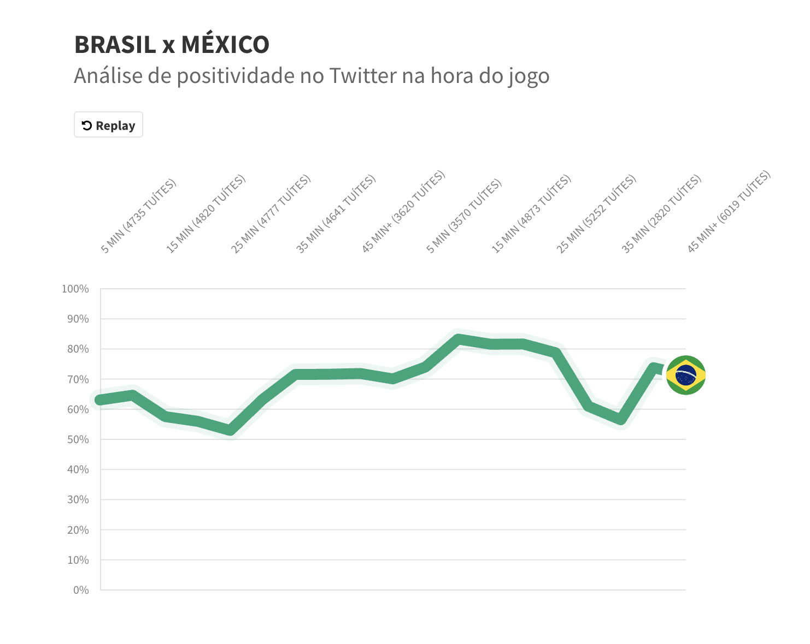

## 🙋🏻‍♀️ Oi! Meu nome é Judite Cypreste

::: columns
::: {.column width="60%"}
- Sou jornalista de dados há 8 anos.
- Atualmente sou pesquisadora em administração pública na FGV EAESP, onde pesquiso a falta de interoperabilidade entre sistemas públicos.
- Vejam mais sobre meu trabalho e redes [aqui.](https://juditecypreste.com/)
:::

::: {.column width="40%"}
{width=300px style="border-radius: 50%;"}
:::
:::
---

## 🎙️ Bate-papo rápido: minhas experiências com programação {.smaller}

Aprendi a programar quando decidi que queria investigar histórias que pareciam impossíveis de contar manualmente.

Um dos meus primeiros projetos foi durante a Copa do Mundo de 2018, quando quis mostrar como os torcedores brasileiros estavam se sentindo, em tempo real, com base no que publicavam no ex-Twitter.

{width=500px style="display: block; margin-left: auto; margin-right: auto;"}

---

Uma das coisas que me fez não desistir de aprender a programar foi sempre pensar em ideias de projetos. Eu estudava para resolver aquele problema, mas acabava aprendendo coisas que serviam para várias outras apurações.

**Eu sempre digo que programar é como aprender uma língua: sempre haverá algo novo para você aprender, por mais fluente que você acha que seja.**

---

## 📝 O que vamos ver hoje:

- Por que aprender Python?
- Instalação
- Conceitos básicos (variáveis, listas, dicionários)
- Meu primeiro programa
- Lendo e analisando uma base de dados com `pandas`

---

## Antes de continuar, vamos entender porque aprender Python é legal!

---

## 🐍 Por que aprender Python? {.smaller}

- Porque hoje existem dados sobre praticamente qualquer assunto, mas nem sempre eles podem ser abertos no Excel ou Google Sheets... e você pode perder a chance de encontrar uma história ou checar uma informação.
- Porque Python não serve só pra analisar dados: ele também ajuda a automatizar tarefas, raspar sites (extrair dados automaticamente de páginas da web)...
- Porque aprender Python é aprender lógica, organização e pensamento estruturado, coisas que servem pra programar, mas também pra pensar e investigar melhor.
- Porque você não precisa virar programador(a). Só precisa entender o suficiente pra mexer nos dados com autonomia e fazer perguntas melhores.
- Porque tem uma comunidade gigante no mundo inteiro e alguém já teve exatamente a dúvida que você vai ter. A resposta já tá na internet, só esperando você encontrar.
- Porque por mais que a AI possa te ajudar a fazer códigos, se você não souber o que ela está fazendo, não saberá se o programa que ela te deu está correto.

---

## 🛠️ Agora vamos para a prática!

---

## ⚙️ Instalação do Python {.smaller}

A pior parte de aprender Python costuma ser **instalar no computador**: mil versões, erro no terminal, PATH que some... caos. O que levaria algum tempo para conseguirmos concluir.

Então para esta aula, vamos  **pular essa parte** e utilizar o [Google Colab](https://colab.research.google.com), que roda no navegador, sem precisar instalar nada.

---

## 📥 E se eu quiser instalar depois?

Quando vocês saírem daqui, provavelmente vão querer instalar o Python no computador de vocês (espero! 😄)

Aqui estão os tutoriais por sistema operacional:

- **Linux**: [python.org.br/instalacao-linux](https://python.org.br/instalacao-linux/)
- **Windows**: [python.org.br/instalacao-windows](https://python.org.br/instalacao-windows/)
- **Mac**: [python.org.br/instalacao-mac](https://python.org.br/instalacao-mac/)

---

## 🚀 E agora vamos para a prática!

::: columns
::: {.column width="60%"}
Acesso ao exercício:  
[https://bit.ly/oficina-python-congresso-abraji-2026](https://bit.ly/oficina-python-congresso-abraji-2026)
:::

::: {.column width="40%"}
{width=300px}
:::
:::